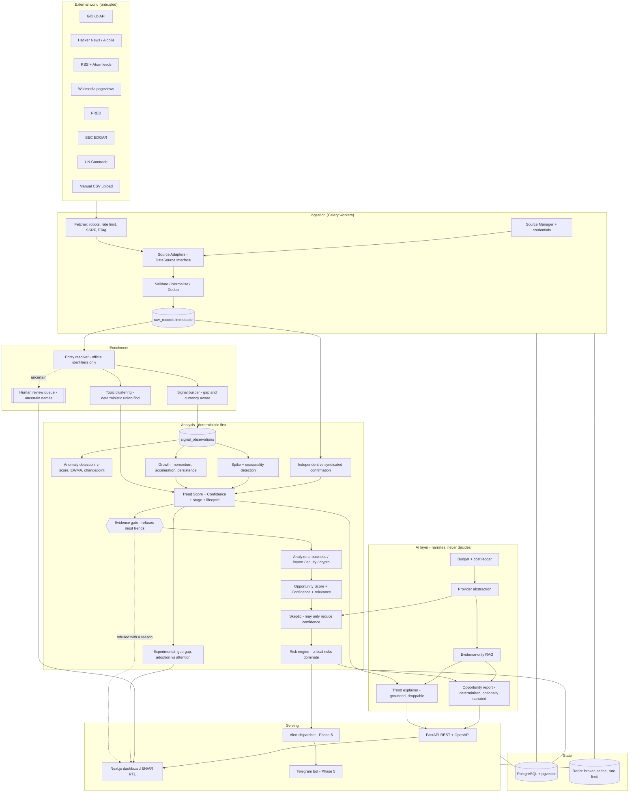
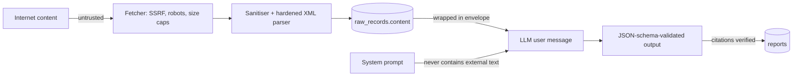

# Architecture — Opportunity Intelligence System (OIS)

> **Status:** Phases 1 and 2 implemented. Phases 3–6 are specified but not built.
> Anything not implemented is marked here and in `docs/changelog.md`.

## 1. Design goals

| Goal | Consequence on architecture |
|---|---|
| Evidence over opinion | Every derived object stores a foreign key back to the immutable `raw_records` row it came from. Reports may only cite `evidence_items`. |
| Determinism before LLM | Anomaly detection, scoring and thresholds are pure Python/NumPy. The LLM only writes narrative and classifies. |
| Cheap by default | 5-stage funnel (filter -> statistics -> rules -> small model -> large model). Only shortlisted opportunities reach an expensive model. |
| Untrusted input | All external text is treated as hostile: sanitised, envelope-wrapped, never in a system prompt. Feeds are parsed with a hardened XML reader. |
| Polite collection | One `Fetcher` owns robots.txt, rate limits, SSRF and conditional requests. Adapters cannot bypass it because they never see an HTTP client. |
| Auditability | Predictions and evidence are append-only. No hard deletes; outcomes are recorded even when wrong. |
| Provider independence | `app/ai/provider.py` defines an `LLMProvider` protocol; OpenAI / Anthropic / Gemini / local are adapters. |

## 2. Component map



## 3. Data flow (one collection cycle)

```mermaid
sequenceDiagram
    participant Beat as Celery Beat
    participant W as Worker
    participant F as Fetcher
    participant S as Source Adapter
    participant DB as PostgreSQL
    participant A as Analytics

    Beat->>W: run_source(source_id)
    W->>DB: create source_runs row (status=running)
    W->>DB: load encrypted credentials, stored ETags
    W->>F: build Fetcher(rate limit, robots policy, conditional store)
    W->>S: fetch(since=last_success_at)
    S->>F: get_json / get_text
    F->>F: SSRF guard -> robots.txt -> token bucket -> If-None-Match
    F-->>S: 200 body, or 304 Not Modified, or a typed error
    S-->>W: list[RawSignal] (or PartialFetchError carrying what it got)
    W->>W: validate -> normalise -> content_hash
    W->>DB: INSERT raw_records ON CONFLICT (source_id, content_hash) DO NOTHING
    W->>W: sanitise text (neutralise instruction-like content)
    W->>DB: upsert entities / entity_aliases
    W->>DB: INSERT signal_observations (idempotent on signal_id + observed_at)
    W->>DB: persist new ETag / Last-Modified per URL
    W->>DB: source_runs -> succeeded|partial|failed; sources.last_success_at = now
    A->>DB: read observation windows (gaps skipped, never read as 0)
    A->>A: pct change, MA, z-score, EWMA, changepoint
    A->>A: growth / momentum / acceleration / persistence / spike / seasonality
    A->>A: group sources, fingerprint headlines, count independent confirmation
    A->>A: Trend Score, Confidence, stage, next lifecycle state
    A->>DB: UPDATE the existing trends row for this subject (never a new one)
    A->>DB: INSERT trend_snapshots (immutable) + refresh trend_signals
```

The last two lines are the whole point of the lifecycle: an evaluation finds the
row for `(subject_type, entity_id, topic_id, geo_scope)` and advances it. A trend is
a thing followed over time, not a discovery announced every morning.

## 3b. Opportunity generation (Phase 4)

```mermaid
sequenceDiagram
    participant T as Trends
    participant G as Evidence gate
    participant A as Type analyzer
    participant S as Scorer
    participant K as Skeptic
    participant R as Risk engine
    participant DB as PostgreSQL

    T->>G: every trend, with its supporting series
    G->>G: 3 signal types, 2 classes, 2 source families, quality, no spike/season
    G-->>DB: refused, with the reason (most trends stop here)
    G->>A: the ones that qualify
    A->>A: enrich; anything unevidenced stays UNKNOWN and scores nothing
    A->>S: facts + flags
    S->>S: 8 components, 20 penalties (capped), separate confidence
    S->>K: the case so far
    K->>K: 17 questions; may only SUBTRACT confidence
    K->>R: flags + hints
    R->>R: dominate by worst finding; apply the crypto floor
    R->>DB: UPDATE the candidate for (type, trend, geography)
    R->>DB: INSERT opportunity_scores + skeptic_reviews (both immutable)
    R->>DB: replace risks, conditions, participation paths
```

Ordering is deliberate and matches section 31 of the brief: expensive work never
runs on cheap data. The gate rejects most trends before any analyzer runs, and no
language model is invoked anywhere in this sequence — narration happens later, on
request, over an already-decided result.

## 4. Idempotency and retry safety

* `raw_records` has a unique index on `(source_id, content_hash)`; the hash excludes
  `fetched_at`, so re-fetching the same item is a no-op.
* `signal_observations` has a unique index on `(signal_id, observed_at)`.
* `http_cache_entries` stores ETag / Last-Modified per `(source, url)` so the next
  run asks "has this changed?" instead of re-downloading.
* `source_runs` records status, counts, HTTP request count and error. A crashed run
  is left `running` and reaped by a janitor task after `SOURCE_RUN_STALE_MINUTES`.
* Ingestion tasks use `acks_late=True` with bounded retries and backoff, because
  they are idempotent: a redelivered run stores nothing new.
* The notification tasks (`ois.run_monitoring`, `ois.run_digests`, and the ordered
  `ois.run_nightly_pipeline` that contains them) are the opposite, deliberately:
  `acks_late=False` and no whole-batch retry, because `alerts.dispatch` sends to
  Telegram/SMTP *before* the transaction recording the send commits. Redelivering
  a batch that had already sent part of itself would send that part again. They
  recover through the next scheduled run and the unique `(user_id, dedupe_key)`
  constraint instead — best-effort delivery, not at-least-once: duplicate
  database records are constrained for one dedupe identity, external delivery can
  still be lost or repeated, and equivalent regenerated events may carry
  different identities.
* `digests` is unique on `(user_id, frequency, period_key)`, where `period_key`
  names a canonical period (`daily:2026-09-06`, `weekly:2026-W36`) rather than
  the instant the task ran. Digests are stored rows with no external send, so
  they are the one phase that retries: bounded, and only over the periods that
  rolled back, with each retry carrying the original period key and boundaries so
  a retry after midnight still writes the period it was scheduled for. On-demand
  digests keep a NULL key and stay repeatable. A digest is a row the user reads in
  the application; **no channel delivers it**. `docs/scheduling.md` states the
  whole guarantee, including the crash window it cannot close.
* Partial source failure is normal: an adapter returns what it managed to fetch and
  raises `PartialFetchError` carrying those records; the run is marked `partial`.

## 5. Trust boundaries



Rules enforced in code:

1. External text never enters a system prompt.
2. External text is wrapped in `<<<UNTRUSTED_CONTENT nonce>>> ... <<<END>>>`.
3. Known injection markers are neutralised and logged, not silently dropped.
4. Feeds are parsed with `defusedxml` where available; without it, a DOCTYPE is
   refused outright and bodies are size-capped, because DTD entity expansion is
   the classic XML denial-of-service vector.
5. LLM output is parsed as JSON against a Pydantic schema; free text is rejected.
6. Any `evidence_id` cited by the model that does not exist for that opportunity
   causes the report to be rejected (`UngroundedReportError`), not repaired.
7. The LLM has **no tools**. Agentic tool use is deferred until the injection
   test-suite covers it.

## 6. The collection policy layer

Adapters never import `httpx`. They receive a `Fetcher`, which owns:

| Control | Behaviour |
|---|---|
| SSRF guard | scheme/port allowlist, private and link-local ranges blocked, DNS resolution checked |
| robots.txt | fetched and cached per host for 24h; honoured for feed/web adapters, skipped for documented JSON APIs with published terms |
| Rate limit | per-source token bucket in Redis (in-memory in tests), plus a per-run request ceiling |
| Conditional requests | ETag / If-Modified-Since sent automatically; 304 is counted, not treated as empty data |
| Identification | descriptive `User-Agent` plus a `From` contact address on every request (SEC requires this) |
| Error typing | 429 -> `RateLimitedError` with Retry-After, 4xx -> `SourceUnavailableError` naming the URL, 5xx -> upstream outage |

The transport is injectable. In tests it is a `RecordedTransport` reading JSON
fixtures from `backend/tests/fixtures/`, which is why no test can open a socket.

## 7. Cost control funnel

| Stage | Cost | What it removes |
|---|---|---|
| 1. Deterministic filters | ~0 | stale, low-volume, blacklisted, duplicate |
| 2. Statistics | ~0 | non-anomalous series |
| 3. Rule scoring | ~0 | below `MIN_RAW_SCORE`, fails 3-signal/2-source gate |
| 4. Small model classify | low | mislabelled category, obvious hype |
| 5. Large model | high | only top `AI_SHORTLIST_SIZE` per day |

`model_runs` stores provider, model, prompt version, tokens and USD cost.
`AI_DAILY_BUDGET_USD` / `AI_MONTHLY_BUDGET_USD` are hard stops enforced before the
call is made.

## 8. Deployment topology

Single-node Docker Compose: `postgres` (pgvector) · `redis` · `api` (uvicorn) ·
`worker` (celery) · `beat` (celery beat) · `web` (Next.js).

Scale-out path: workers scale horizontally first (queues `ingest`, `analyze`, `ai`),
then read replicas for Postgres, then partition `signal_observations` by month.

## 9. Estimated infrastructure (single private user)

| Component | Phase 2 | Phase 6 |
|---|---|---|
| Postgres | 1 vCPU / 2 GB / 20 GB | 2 vCPU / 8 GB / 200 GB |
| Redis | 256 MB | 1 GB |
| API | 1 vCPU / 1 GB | 2 x 1 vCPU |
| Workers | 1 x 1 vCPU / 1 GB | 3 x 1 vCPU / 2 GB |
| Web | 0.5 vCPU / 512 MB | same |
| AI spend | 0 (LLM optional) | ~USD 20-60 / month at 30 shortlisted/day |

With the seeded source set collecting daily, expect roughly 60k–200k `raw_records`
and 150k–400k `signal_observations` per year — comfortable on one node for years.
Conditional requests keep most days far below the upper figure.
