# Database Schema

PostgreSQL 16 + `pgvector`. All primary keys are UUIDv4. Every table has
`created_at timestamptz not null default now()`; mutable tables also have
`updated_at`. Immutable tables have no UPDATE path in the application layer.

## Entity relationship model

```mermaid
erDiagram
    users ||--o| user_preferences : has
    users ||--o{ watchlists : owns
    users ||--o{ user_notes : writes
    users ||--o{ user_decisions : records
    users ||--o{ notifications : receives

    sources ||--o{ source_credentials : has
    sources ||--o{ source_runs : produces
    sources ||--o{ raw_records : produces
    sources ||--o{ http_cache_entries : caches
    source_runs ||--o{ raw_records : produced_in

    raw_records ||--o{ evidence_items : cited_as
    raw_records ||--o{ signal_observations : supports

    entities ||--o{ entity_aliases : has
    entities ||--o{ signals : subject_of
    entities ||--o{ topic_entities : in
    entities ||--o{ entity_match_candidates : awaiting_review
    entities ||--o{ trends : subject_of
    topics ||--o{ topic_entities : contains
    topics ||--o{ trends : subject_of

    signals ||--o{ signal_observations : timeseries
    signals ||--o{ trend_signals : supports
    signals ||--o{ opportunity_signals : supports

    trends ||--o{ trend_snapshots : history
    trends ||--o{ trend_signals : built_from

    opportunities ||--o{ opportunity_signals : uses
    opportunities ||--o{ opportunity_entities : about
    opportunities ||--o{ opportunity_trends : built_from
    opportunities ||--o{ opportunity_topics : about
    opportunities ||--o{ opportunity_scores : scored_by
    opportunities ||--o{ opportunity_risks : flagged_with
    opportunities ||--o{ opportunity_conditions : confirmed_or_invalidated_by
    opportunities ||--o{ opportunity_participation : acted_on_via
    opportunities ||--o{ opportunity_decisions : judged_by
    opportunities ||--o{ skeptic_reviews : challenged_by
    opportunities ||--o{ reports : documented_by
    trends ||--o{ opportunities : may_produce
    opportunities ||--o{ predictions : snapshotted_as
    opportunities ||--o{ user_notes : annotated_by
    opportunities ||--o{ user_decisions : decided_on
    opportunities ||--o{ alerts : triggers

    reports ||--o{ evidence_items : cites
    predictions ||--o{ prediction_outcomes : measured_by
    watchlists ||--o{ watchlist_items : contains
    alerts ||--o{ notifications : delivered_as
    model_runs }o--|| prompt_versions : used
```



## Table notes

| Table | Purpose | Mutability |
|---|---|---|
| `users` | login identity, role (`admin`/`analyst`/`viewer`), Argon2id hash | mutable; `is_active` soft-delete |
| `user_preferences` | countries, industries, risk cap, min confidence, capital range, exclusions, plus the Phase 4 relevance inputs: `type_priority`, `priority_geographies`, `experience_industries`, supplier and distribution access, `technical_ability`, `weekly_hours_available`, `regulatory_access`. **These describe a profile, not a person: nothing about any country is in the domain model.** | mutable |
| `sources` | registry: slug, adapter key, enabled, schedule, rate limit, reliability, `last_success_at`, `consecutive_failures`, adapter `config` | mutable |
| `source_credentials` | Fernet-encrypted secrets, plus a short `hint` for recognition; rotation timestamps | mutable |
| `source_runs` | one row per collection attempt: status, fetched/stored/duplicate/rejected counts, `http_requests`, duration, error | append-only after finish |
| `raw_records` | verbatim payload + sanitised copy + `content_hash` + url | **immutable** |
| `http_cache_entries` | ETag / Last-Modified per (source, url) so repeat fetches are conditional | mutable |
| `entities` | canonical entity: type, name, normalised key, country, ticker, and `external_ids` — the official identifiers (SEC CIK, GitHub repo id, ticker+exchange, ISO country, contract address+chain) that are the *only* basis on which two records are merged | mutable |
| `entity_aliases` | alias -> entity, unique on `(normalized, entity_type)` | mutable |
| `topics` | deterministic cluster: label, `category`, `keywords`, `first_seen_at`, `last_seen_at`, `label_is_ai_generated`, optional `embedding vector(768)` | mutable |
| `topic_entities` | join with weight | mutable |
| `entity_match_candidates` | a name the system refused to merge on its own: observed name, candidate entity, similarity, reason, evidence, and the human `decision` with who made it and when | mutable until decided, then fixed (a second decision returns 409) |
| `signals` | *definition* of a measured series: (entity, signal_type, geo_scope, source) | mutable |
| `signal_observations` | one measurement: **nullable** `value`, `status` (`ok`/`missing`/`failed`), `currency`, previous, pct change, confidence, source reliability, `is_proxy`, raw_record_id | **immutable** |
| `trends` | one followed subject (entity or topic) per geo scope: `state`, `stage`, `trend_score`, `confidence`, `peak_score`, `first_detected_at`, `last_evaluated_at`, `components`, `penalties`, `metrics`, `warnings`, `is_spike`, `is_seasonal`, `explanation` | mutable — updated in place, never re-created daily |
| `trend_snapshots` | the score, confidence, stage, state, components and penalties as they stood at one evaluation, with `formula_version` | **immutable** |
| `trend_signals` | which measured series supports a trend, with its contribution, growth, observation count, proxy flag and whether it counted as independent | mutable |
| `opportunities` | one candidate per (type, trend, geography): `opportunity_type`, lifecycle `state`, `validation_status` (demo/unvalidated/live_validated), `opportunity_score`, `confidence`, `personal_relevance`, `risk_level`, components, penalties, confidence and relevance breakdowns, thesis, counter-thesis, mechanism, `why_early`, `missing_evidence`, `next_research_steps`, analyzer `analysis`, experimental `geographic_gap` and `adoption_attention_ratio`, `algorithm_version` | mutable — updated in place, never re-created |
| `opportunity_trends` / `opportunity_topics` | every trend and topic supporting a candidate | append-only |
| `opportunity_conditions` | what would confirm the thesis and what would prove it wrong, stored as checkable rows with a `measurable` payload | mutable state (`pending`/`met`/`broken`) |
| `opportunity_participation` | concrete ways to take part: build, import, distribute, investigate, provide service, learn skill, partner, watch | replaced per evaluation |
| `opportunity_decisions` | the human judgement, with the score, confidence, risk, relevance, state and algorithm version **copied** as they stood | **immutable** |
| `opportunity_signals` / `opportunity_entities` | supporting links | append-only |
| `opportunity_scores` | full breakdown: components, penalties, adjusted score, confidence, formula version | **immutable** (new row per rescore) |
| `opportunity_risks` | one of eleven categories, with severity, our `confidence` that it is real, rationale, evidence links, a `mitigation` where one exists, and `is_blocking` | replaced per evaluation |
| `skeptic_reviews` | the strongest counterargument, all counterarguments, missing evidence, red flags, alternative explanations, too-late and inaccessible reasons, manipulation probability, the questions asked, and a `confidence_reduction` that is only ever subtracted | **immutable** (a new row per pass) |
| `reports` | rendered sections, language, confidence, citation density | **immutable** (regenerate = new row) |
| `evidence_items` | claim + raw_record_id + url + quote + claim confidence | **immutable** |
| `watchlists`, `watchlist_items` | user follows entity/topic/keyword/country with thresholds | mutable (Phase 5) |
| `alerts`, `notifications` | rules and delivery records | mutable / append-only (Phase 5) |
| `user_notes` | free text per opportunity | mutable |
| `user_decisions` | confirm / reject / watch / act, with reason | **immutable** |
| `predictions` | frozen snapshot at detection time | **immutable** |
| `prediction_outcomes` | measurement at +30/+90/+180/+365 days | append-only |
| `system_audit_logs` | actor, action, object, ip, before/after | **immutable** |
| `model_runs` | provider, model, prompt version, tokens, USD cost, latency | **immutable** |
| `prompt_versions` | name, version, template, hash | **immutable** |

## Key indexes

```sql
CREATE UNIQUE INDEX ux_raw_records_source_hash  ON raw_records (source_id, content_hash);
CREATE UNIQUE INDEX ux_signal_obs_signal_time   ON signal_observations (signal_id, observed_at);
CREATE UNIQUE INDEX ux_signal_definition        ON signals (entity_id, signal_type, geo_scope, source_id);
CREATE UNIQUE INDEX ux_entity_alias_norm        ON entity_aliases (normalized, entity_type);
CREATE UNIQUE INDEX ux_http_cache_source_url    ON http_cache_entries (source_id, url_hash);
CREATE UNIQUE INDEX ux_source_credential        ON source_credentials (source_id, key);
CREATE INDEX ix_signal_obs_time                 ON signal_observations (observed_at DESC);
CREATE INDEX ix_opportunities_score             ON opportunities (adjusted_score DESC, detected_at DESC);
CREATE INDEX ix_raw_records_fetched             ON raw_records (fetched_at DESC);

-- Phase 3
CREATE UNIQUE INDEX ux_trend_subject             ON trends (subject_type, entity_id, topic_id, geo_scope);
CREATE UNIQUE INDEX ux_trend_signal              ON trend_signals (trend_id, signal_id);
CREATE UNIQUE INDEX ux_match_candidate           ON entity_match_candidates (observed_normalized, entity_type, candidate_entity_id);
CREATE INDEX ix_trends_trend_score               ON trends (trend_score);
CREATE INDEX ix_trend_snapshots_trend_id         ON trend_snapshots (trend_id);
CREATE INDEX ix_signal_observations_status       ON signal_observations (status);
CREATE INDEX ix_raw_records_title_fingerprint    ON raw_records (title_fingerprint);

-- Phase 4
CREATE UNIQUE INDEX ux_opportunity_subject       ON opportunities (opportunity_type, primary_trend_id, geo_scope);
CREATE UNIQUE INDEX ux_opportunity_trend         ON opportunity_trends (opportunity_id, trend_id);
CREATE INDEX ix_opportunities_opportunity_score  ON opportunities (opportunity_score);
CREATE INDEX ix_opportunities_personal_relevance ON opportunities (personal_relevance);
CREATE INDEX ix_opportunities_validation_status  ON opportunities (validation_status);
CREATE INDEX ix_opportunity_decisions_decided_at ON opportunity_decisions (decided_at);
```

`ux_opportunity_subject` is the Phase 4 counterpart of `ux_trend_subject`: an
evaluation finds the candidate for (type, trend, geography) and updates it, so a
candidate accumulates a history instead of being rediscovered every morning.

`ux_trend_subject` is what stops a new trend being invented every day: an
evaluation either finds the existing row for that subject and updates it, or there
is no row and one is created.

## Missing data and currency

`signal_observations.value` is nullable. A period a source did not report is stored
with `value = NULL` and `status = 'missing'`; a failed fetch is `status = 'failed'`.
Neither is ever stored as `0.0`. Monetary observations carry `currency` alongside the
amount and are kept in the currency the source published — no figure is overwritten
by a converted one.

## Immutability enforcement

Immutable models inherit `ImmutableMixin`, and a SQLAlchemy `before_flush` listener
raises `ImmutableRowError` on any update or delete of such a row. Tests cover both
paths. A database-level `BEFORE UPDATE OR DELETE` trigger is planned for Phase 6;
until then, direct SQL can still bypass this — stated in `docs/security.md`.
